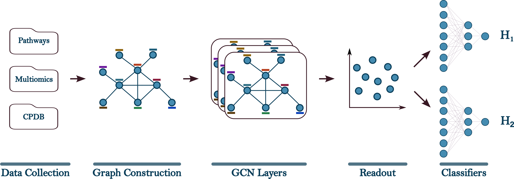

# Cancer Driver Gene Prediction using Graph Neural Networks

This repository contains the code, data, and models for our paper:

**“MTDriverGNN: Multitask Learning Graph Neural Network for Cancer Driver Gene Prioritization”**  

##  Overview

The figure below provides an overview of the modelling workflow, including data collection, graph construction, node representation learning with a GCN encoder, and task-specific prediction

  

The pipeline consists of:
- **Graph Construction**: CPDB  
- **Node Features**: Integrated multi-omics and pathway annotations  
- **GCN Layers**: Message passing and node embedding  
- **Readout**: Extract node-level features  
- **MLP**: Final classification layer

Although not shown in the figure, we also introduce a cancer-agnostic pretraining phase to initialize model weights. This initialization helps improve generalization, especially in cancers with limited labeled data, and enables the model to transfer knowledge across cancer types.

##  Key Features

- Integrated multi-omics gene representation (Combines mutation, expression, methylation, CNA features with KEGG pathway annotations)  
- Telomere-aware multitask learning 
- Stage pretraining: Cross-disease supervised pretraining
- Robust evaluation across cancers and metrics
 

##  Repository Structure
Data/ – Directory containing preprocessed input datasets used for model training

Supplementary.pdf – Supplementary document detailing methodology and results

Results/
- Directory containing the output results of the proposed model.
- Includes gene ranking files for:
  - BRCA (Breast Invasive Carcinoma)
  - PRAD (Prostate Adenocarcinoma)
- Each file lists genes ranked by their predicted disease relevance scores.

Source/
- Directory containing the source code of the proposed framework.
- Includes scripts for data preprocessing, model implementation, training, and evaluation.

README.md – Project overview and usage instructions

